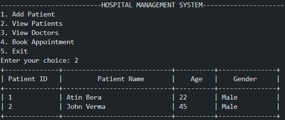

# Hospital Management System

## 📌 Overview
The **Hospital Management System** is a Java-based application designed to efficiently manage hospital operations such as patient records, doctor details, and appointment bookings. The system enables users to add and view patients, check doctor availability, and schedule appointments seamlessly using a MySQL database for data storage.

## 🔥 Features
- **Patient Management**: Add new patients and view existing records.
- **Doctor Management**: Retrieve and list available doctors.
- **Appointment Booking**: Schedule appointments and check doctor availability.
- **Database Integration**: Uses MySQL for storing and managing data.
- **User-Friendly Interface**: Interactive CLI-based input system.

## 🛠️ Tech Stack
- **Programming Language**: Java (JDK 8+)
- **Database**: MySQL
- **JDBC**: For database connectivity

## 📂 Project Structure
```
HospitalManagementSystem/
│── src/
│   ├── HospitalManagementSystem.java  # Main class
│   ├── Patient.java                   # Patient-related operations
│   ├── Doctor.java                    # Doctor-related operations
│── README.md                          # Documentation
│── hospital_db.sql                    # Database schema
```

## 🚀 Setup & Installation
### 1️⃣ Prerequisites
- Install **Java (JDK 8 or later)**
- Install **MySQL Server** and create a database
- Install **VS Code** (or any Java-supported IDE)

### 2️⃣ Clone the Repository
```sh
git clone https://github.com/atinbera/Hospital-Management-System.git
cd hospital-management-system
```

### 3️⃣ Database Setup
- Import `hospital_db.sql` into MySQL:
```sql
CREATE DATABASE hospital;
USE hospital;

CREATE TABLE patients (
    id INT AUTO_INCREMENT PRIMARY KEY,
    name VARCHAR(100) NOT NULL,
    age INT NOT NULL,
    gender VARCHAR(10) NOT NULL
);

CREATE TABLE doctors (
    id INT AUTO_INCREMENT PRIMARY KEY,
    name VARCHAR(100) NOT NULL,
    specialization VARCHAR(100) NOT NULL
);

CREATE TABLE appointments (
    id INT AUTO_INCREMENT PRIMARY KEY,
    patient_id INT,
    doctor_id INT,
    date DATE NOT NULL,
    FOREIGN KEY (patient_id) REFERENCES patients(id),
    FOREIGN KEY (doctor_id) REFERENCES doctors(id)
);
```

### 4️⃣ Configure Database Connection
Update database credentials in `HospitalManagementSystem.java`:
```java
private static final String url = "jdbc:mysql://localhost:3306/hospital";
private static final String username = "root";
private static final String password = "TypeYourMySQLPasssword";
```

### 5️⃣ Run the Application
Compile and run the program:
```sh
javac -d . src/*.java
java HospitalManagementSystem
```

## 📷 Screenshots



## 💡 Future Improvements
- Implement GUI using **Java Swing/JavaFX**
- Add **authentication system** for secure access
- Implement **prescription & billing system**


## 📜 License
This project is licensed under the **MIT License**.

---
**Made with ❤️ by Atin Bera**

